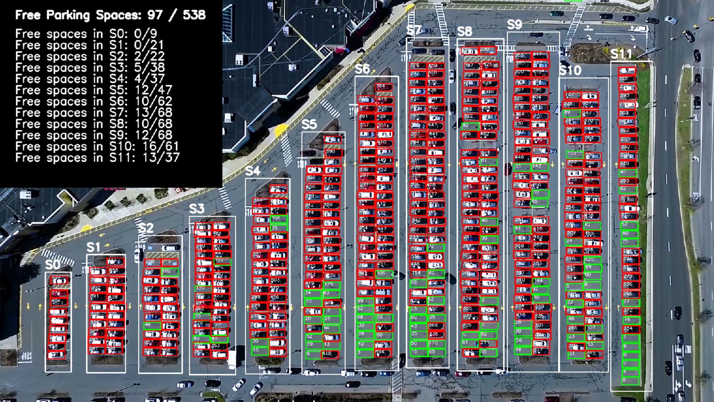

# Parking Space Counter using Python, OpenCV and Pickle
 

## Video Used

Tom Berrigan https://www.youtube.com/watch?v=yojapmOkIfg&list=LL&index=10

* Download this video in 1080p
* Rename it to parkinglot_timeplapse.mp4 
* Place it in project folder

## Packages
```sh
pip install cv2
pip install pickle
```

## Code inspired by:

Murtaza's Workshop - Robotics and AI https://www.youtube.com/watch?v=caKnQlCMIYI
